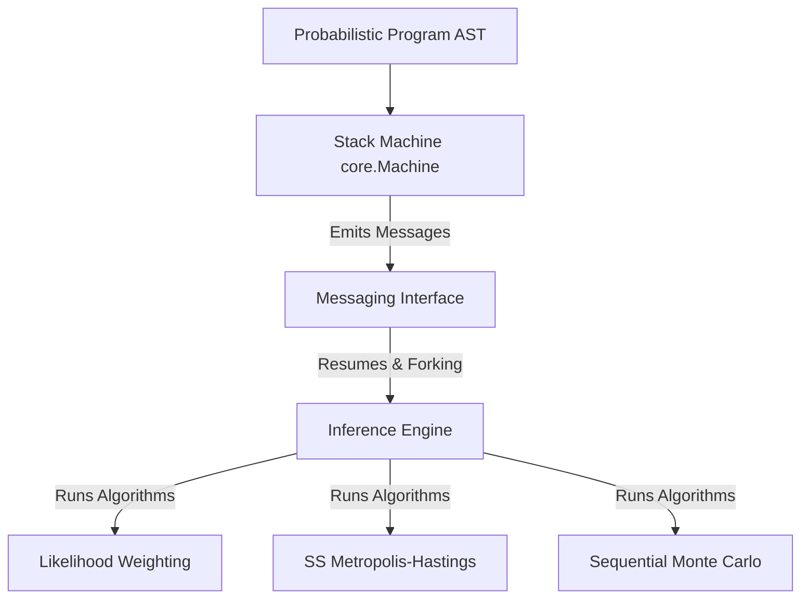

# Java-PPL: A Stack Machine-based Probabilistic Programming Language in Java

Java-PPL is a Java implementation of a stack machine designed to execute Probabilistic Programming Languages (PPLs). It decouples the evaluation of probabilistic programs from the inference algorithms using a continuation-passing style stack machine and a structured messaging interface.

By pausing execution at probabilistic checkpoints (`sample` and `observe`), a controller (or inference engine) can guide the machine's execution, fork its state, or compute sample weights.

---

## 🏗️ Architecture Overview

The codebase is built on three core pillars:



### 1. The Stack Machine (`core.Machine`)
Unlike traditional interpreters that use the host language call stack, `core.Machine` maintains its own explicit:
* **Control Stack (`C`)**: Stores instructions and expressions to be evaluated.
* **Value Stack (`V`)**: Stores evaluated results.
* **Environment (`Environment`)**: Resolves symbol bindings.

This structure allows the machine to **pause**, **resume**, and **fork** (clone) its execution state easily, which is crucial for advanced inference methods like Sequential Monte Carlo.

### 2. The Messaging Interface (`messaging.Message`)
When the machine encounters a probabilistic effect, it suspends execution and returns a message to the active `InferenceEngine`. The possible messages are:
* **`Sample(Address, Distribution)`**: Requests a sample from a prior distribution.
* **`Observe(Address, Distribution, Value)`**: Observes a value against a likelihood distribution.
* **`Done(Value)`**: Signifies that the program finished execution and returned a final value.
* **`Fork()`**: Instructs the engine to duplicate the execution path (used in SMC).

### 3. Inference Engines (`inference.InferenceEngine`)
We implement three standard probabilistic inference algorithms:

* **Likelihood Weighting (LW)**:
  * Samples directly from prior distributions.
  * Accumulates weights at each observation checkpoint based on the likelihood of the observed value.
  * Estimates expectations using weighted samples.
* **Single-Site Metropolis-Hastings (SSMH)**:
  * A Markov Chain Monte Carlo (MCMC) algorithm.
  * Perturbs a single sample site (*proposal address*) at each step and re-executes the stack machine.
  * Decides whether to accept or reject the proposal trace by calculating the log-acceptance ratio of the log priors and log likelihoods.
* **Sequential Monte Carlo (SMC)**:
  * A particle filtering method.
  * Runs multiple `Machine` instances (*particles*) in parallel.
  * When particles hit an `Observe` statement, their execution is suspended, their weights are calculated, and particles are resampled using systematic resampling.

---

## 📂 Project Structure

```
├── build.gradle.kts          # Gradle build configuration
├── src
│   ├── main
│   │   ├── java
│   │   │   ├── ast           # AST node representations (Let, If, Sample, Observe, Fn, etc.)
│   │   │   ├── core          # Interpreter core (Machine, Environment, Parser, Main)
│   │   │   ├── distributions # Probability distributions (Normal, Bernoulli)
│   │   │   ├── Instructions  # Abstract machine instructions (LetK, EvaluateK, SampleK, ObserveK)
│   │   │   ├── inference     # Inference engines (LW, SSMH, SMC)
│   │   │   └── messaging     # Message payload records (Sample, Observe, Done, Fork)
│   │   └── resources         # Original activities & references
│   └── test
│       └── java
│           └── core          # Unit tests & benchmark configurations
```

---

## 🚀 Getting Started

### Prerequisites
* Java JDK 21 or higher
* Gradle (wrapper included)

### Running the Project
To run the main entry point, which executes all 6 example programs using the three inference algorithms:
```bash
./gradlew run
```

### Running the Performance Benchmarks
To compare the speed and convergence characteristics of Likelihood Weighting, SS Metropolis-Hastings, and Sequential Monte Carlo:
```bash
./gradlew benchmark
```

### Running Tests
To run the project's unit test suite:
```bash
./gradlew test
```

---

## 📝 Test Programs (Ejemplos)

The suite contains six sample probabilistic programs designed to test convergence to exact analytical values:

1. **`Ejemplo 1 (conj)`**:
   * A simple normal-normal conjugate model.
   * Model: $\mu \sim \text{Normal}(0, 1)$, Observe: $\text{Normal}(\mu, 1) \to 2.3$.
   * Exact Mean: **1.150**, Exact StdDev: **0.707**.
2. **`Ejemplo 2 (bits)`**:
   * Simulates summing 8 independent Bernoulli trials and observing a noisy normal measurement.
   * Exact Mean: **5.014**, Exact StdDev: **1.146**.
3. **`Ejemplo 3 (multi-normal)`**:
   * Similar to Example 1, but with multiple observations verifying likelihood updating.
   * Exact Mean: **1.333**, Exact StdDev: **0.577**.
4. **`Ejemplo 4 (normal-prior)`**:
   * Normal prior with a higher variance.
   * Exact Mean: **2.231**, Exact StdDev: **1.664**.
5. **`Ejemplo 5 (coin-flips)`**:
   * Models choosing between a biased coin (0.8 probability of heads) and a fair coin (0.5 probability).
   * Exact Mean: **0.506**, Exact StdDev: **0.500**.
6. **`Ejemplo 6 (signal-noise)`**:
   * A signal-noise model where the latent variable is the sum of two independent normals.
   * Exact Mean: **0.599**, Exact StdDev: **0.895**.
